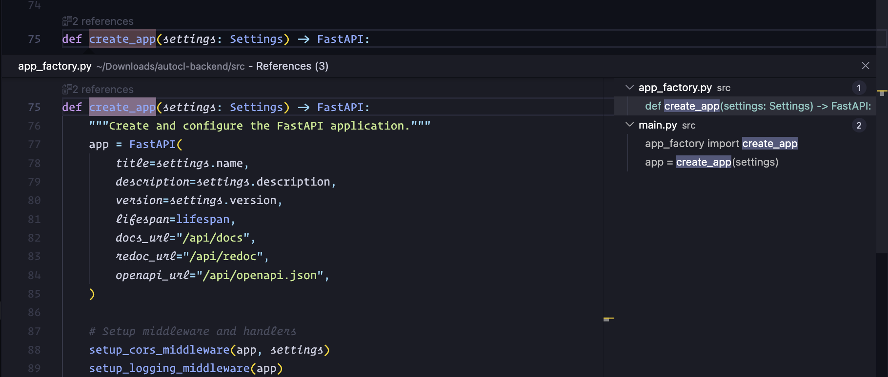

# Python Reference Lens

Shows reference counts above Python functions, classes, and methods — just like JetBrains IDEs (PyCharm).



## Features

- 📊 Shows reference count above every function and class
- 🖱️ Click to "Find All References"
- ⚙️ Configurable: toggle functions, classes, methods separately
- 🚀 Lightweight and fast

## Usage

Once installed, you'll see reference counts above your Python code:

```python
                    # $(references) 3 references
def get_user(id):   # ← Click to find all references
    ...

                    # $(references) 12 references  
class UserService:  # ← Click to find all references
    ...
```

## Configuration

| Setting | Default | Description |
|---------|---------|-------------|
| `pythonReferenceLens.enabled` | `true` | Enable/disable the extension |
| `pythonReferenceLens.showForFunctions` | `true` | Show references for functions |
| `pythonReferenceLens.showForClasses` | `true` | Show references for classes |
| `pythonReferenceLens.showForMethods` | `true` | Show references for class methods |
| `pythonReferenceLens.minReferencesToShow` | `1` | Minimum references to display |

## Commands

- `Python Reference Lens: Toggle` - Enable/disable the extension

## Installation (from source)

1. Clone this repository
2. Run `npm install`
3. Run `npm run compile`
4. Copy the folder to `~/.vscode/extensions/`
5. Restart VS Code

## Installation (VSIX)

1. Run `npm install && npm run compile`
2. Install vsce: `npm install -g @vscode/vsce`
3. Package: `vsce package`
4. Install: `code --install-extension python-reference-lens-1.0.0.vsix`

## Requirements

- VS Code 1.74.0 or higher
- Python extension (for reference provider)

## License

MIT
